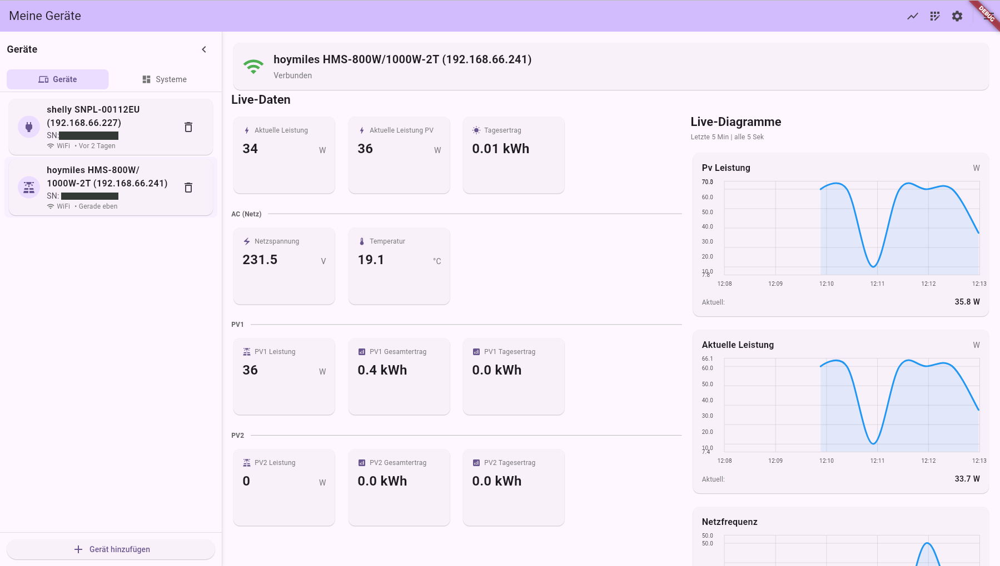
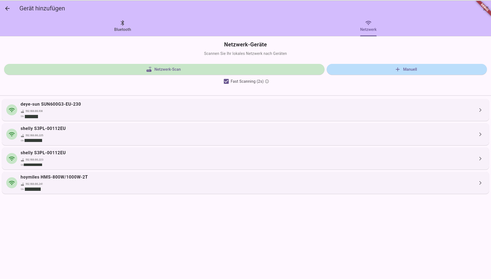
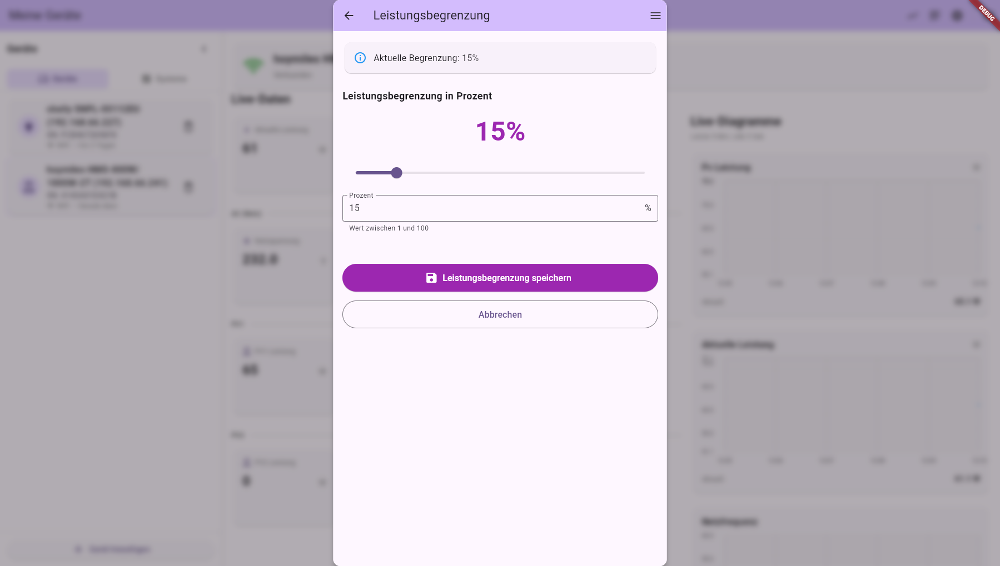

# Desktop Screenshots

Screenshots of The Solar App running on Linux/Windows desktop platforms.

## List and Detail View

Main interface showing the device list on the left and detailed device information on the right.

## Scan for Devices

Desktop device discovery interface for finding and adding new solar equipment via Bluetooth and network scanning.

## Power Regulation

Configure power limits and control settings with the desktop interface, providing precise control over your inverters and power stations.

---

**Note**: The desktop version provides the same functionality as the mobile app but optimized for larger screens. Note that Bluetooth functionality is not available on Linux and Windows desktop builds.
