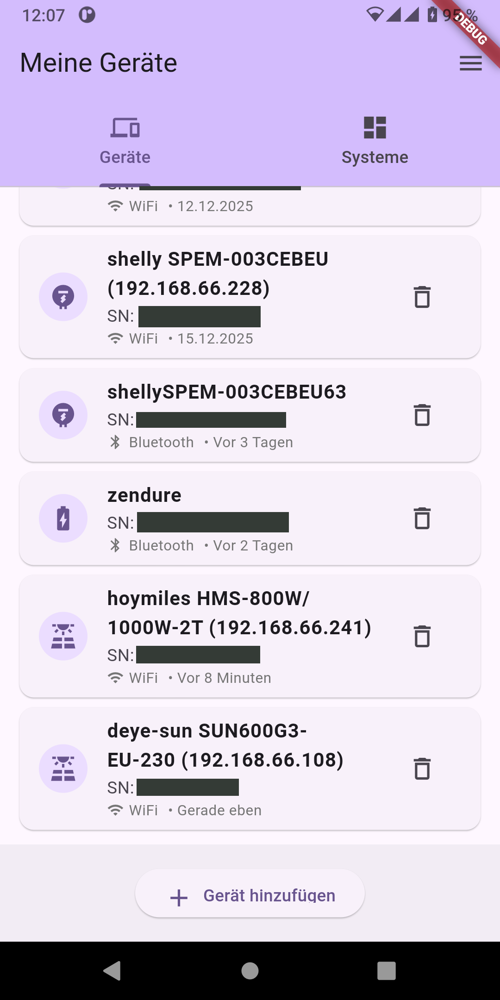
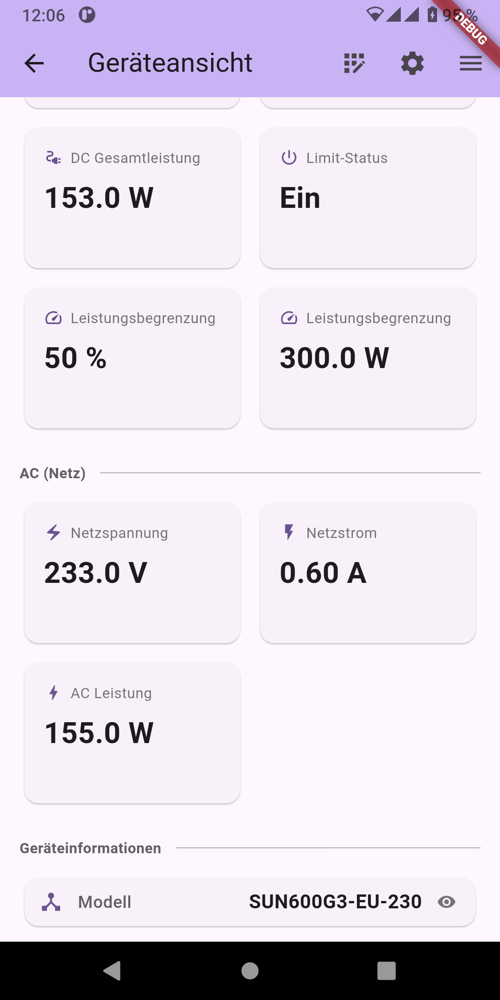
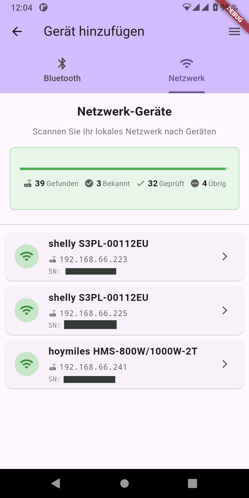
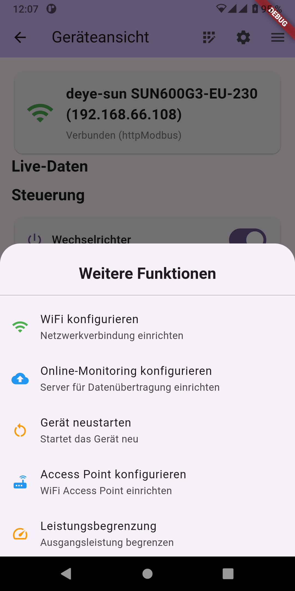
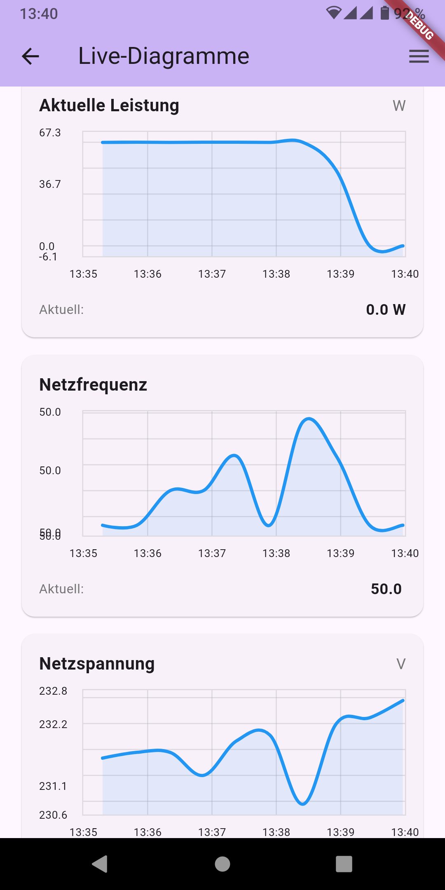
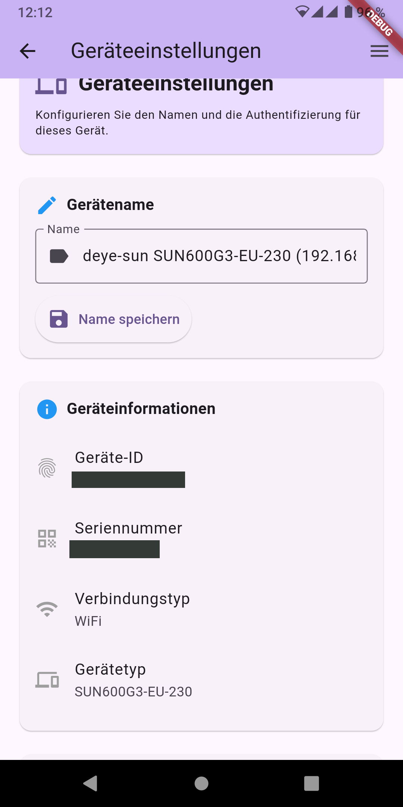
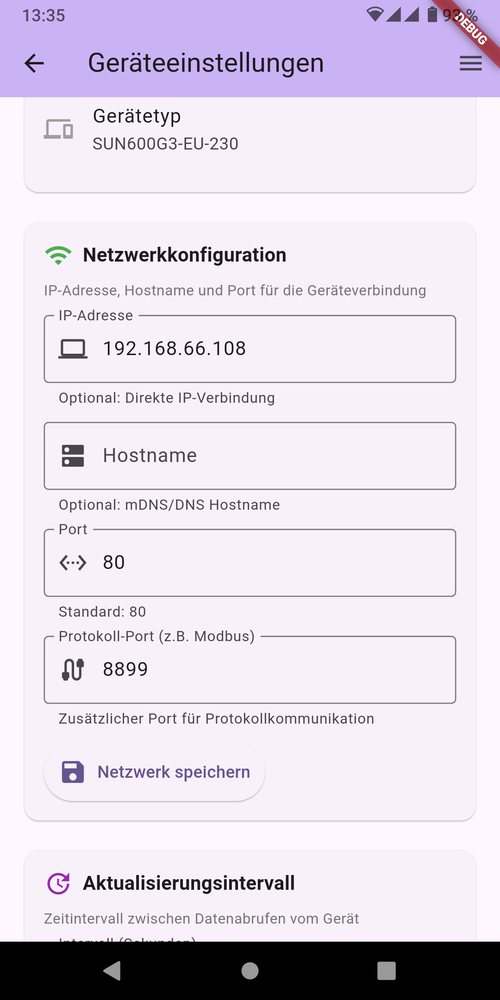
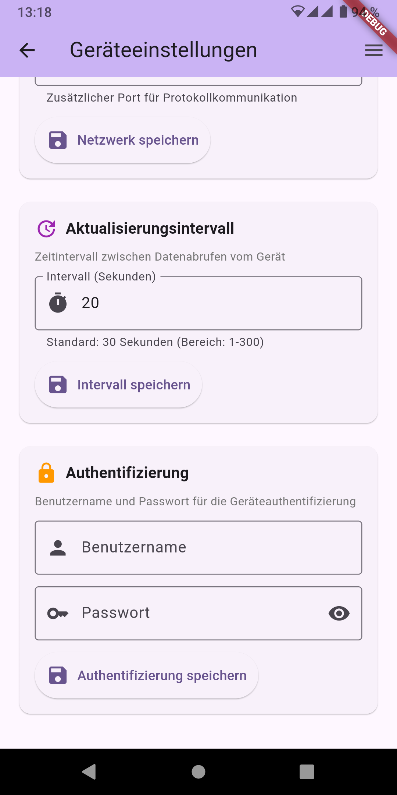

# Mobile Screenshots

Screenshots of The Solar App running on Android devices.

## Device List

The main screen showing all saved devices and quick info.

## Device Detail View

Detailed monitoring view showing real-time power data, battery levels, and device metrics.

## Scan for Devices

Discovery screen for finding new devices via Bluetooth and network scanning.

## Device Functions

Additional device functions and menu options for controlling your solar equipment.

## Graphs

Data visualization and historical trends (last 5 min live) for monitoring your solar system performance.

## Power Regulation

Configure power limits and control settings for your inverters and power stations.

## Settings

Device configuration screens including authentication, WiFi setup, network configuration, and basic parameters.

  
